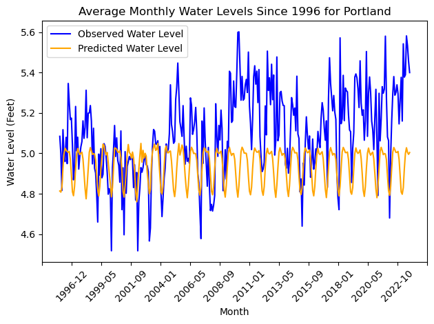
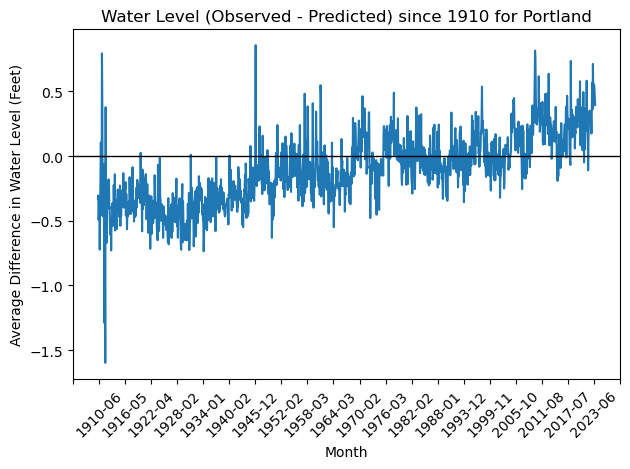
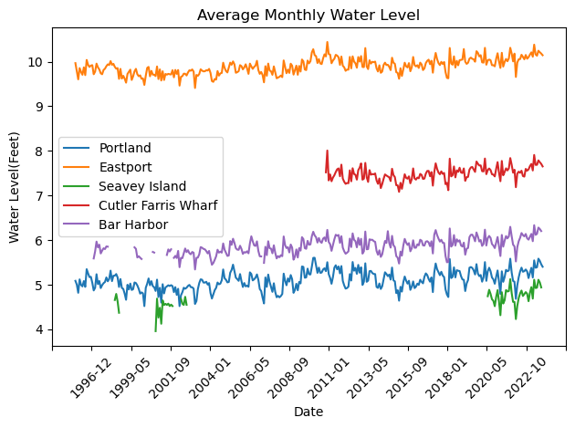

# DS5110 Fall 2023 Maine Ocean Water Levels and U.N. Sustainable Development Goals

Johnathan Green, Lukas Hernandez, Ryan Moore

This project explores measured & predicted water levels and measured water & air temperatures across the NOAA Tides and Currents stations in Maine. Additionally, it explores NOAA Storm data in Maine. These data are analyzed to understand how rising sea levels and increased frequency of severe weather patterns are affecting Maine.

Contents
* [Story](#story)
* [Objectives](#objectives)
* [Results](#results)
* [Challenges](#challenges)
* [Next Steps](#next-steps)

## Story
Original Story described in technical [README.md](../README.md)

Rising sea level is an increasing problem and one that affects
us locally. A rise in sea level by 1.6 feet could submerge 67%
of coastal sand dunes in Maine, increasing the risk of coastal
flooding and erosion. Locations, such as parts of Commercial 
Street, who are already suffering from tidal flooding will face
increased pressure. As time passes, you can see a difference 
between the observed rise in sea level and the predicted.

## Objectives
We want to visualize the change in sea level over time 
compared to the predicted change. With that, we wish to show 
the difference between the actual change and the predicted. 
Using that data and a model created from the actual observed 
change, we will compare it with data showing how that new 
change in sea level will affect us locally in Portland.  

We want to be able to talk about the economic and 
infrastructural impact this change will have. This includes 
water treatment facilities on top of potential flooding in 
areas around Portland. 

We want to explore if storms have an impact to tidal water levels 

## Results
We looked at two sets of data for this project, water levels and storm winds, following are the results.

#### Water Levels
We found that measured sea levels for the Maine coast have been increasing over time. The following images shows the difference in water level measured compared to the expected water levels for Portland.



In the next image, the horizontal line shows where the water level would be if it always matched the predicted water levels.



These graphs strongly suggest there is an increase in water level since the start of taking measurements a century ago.

```
make tides_visuals
```

Upon plotting the water level trends for each of the five stations in Maine we found that it appears the water level measurements trend consistently over time. In combination with the previous finding we believe we can make a strong case exhibiting the sea level rise over decades for coastal Maine.



We didn't find any obvious relationship between the air & water temperatures and water levels.

```
make all_avg_visual
```

#### Storm Winds

The goal of the storm section is to explore the frequency and intensity of storms over time. As the graphs indicate, thunderstorms have become more frequent over time. Wind events make up the majority of the storm dataset and thunderstorm wind has the oldest records. When taken with the tide data, it begs the question of what happens during severe storms that hit at high tide? Low laying areas along the coast of Maine, including Commercial Street, already face this issue. As sea level rises and storm frequency increases, flooding will likely become a more frequent issue to contend with.


```
make storm_visuals
```

## Challenges
* The NOAA Tides and Currents data set is rich and available in extremely granular slices. To be able to explore this data in the way we did, we had to robust the data pull. This limited the analyses we were able to complete on the sea level rise problem.

## Next Steps
* Remove the waveform of temperature visualizations to continue analysis in the context of the water levels data.
* Create visualizations that demonstrate the rise in water levels for a general audience such as an overlay on satelite images or a simulated renderings of water levels in photos
* Plot tides data and storms data together to determine relationships and patterns, if any.