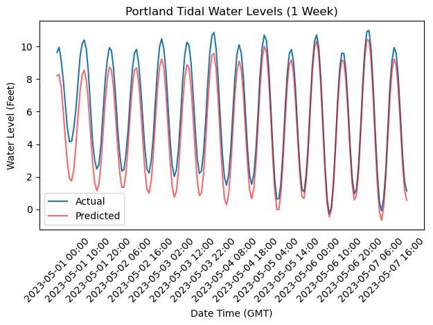

To generate the EDA figure:

```bash
make eda
```

We were able to retrieve Tides and Water Levels data from the NOAA web service. We pulled data for the Portland, Maine, USA station. Following is a graph that shows measured tidal water levels compared to predicted water levels over a one week period starting May 1, 2023. From this graph it is clear that tidal waters are measuring higher than expected.



<i>Figure 1. Portland, ME Measured Water Levels vs Predicted Water Levels From May 1, 2023 to May 7, 2023</i>